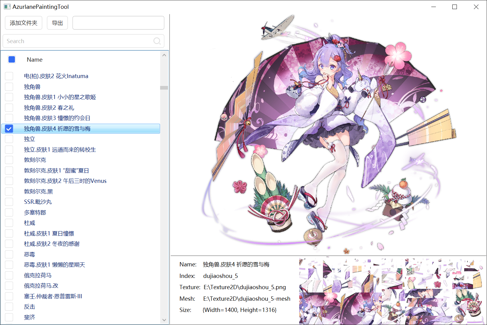

# AzurLane-Painting-Tool
碧蓝航线立绘导出小工具

### 怎么用

1. 拖入obj和png文件，或直接选择文件夹；
2. ……

### 其他
- .NET Framework 4.7.2
- 感谢项目([AzurLanePaintingExtract-v1.0](https://github.com/azurlane-doujin/AzurLanePaintingExtract-v1.0))分享的算法和相关文件
- 少数立绘因为图片内容不全无法还原
- 少数立绘无需还原，若还原图片则被打乱

### 老婆们
.军师大人.png)
.细语春霞.png)

---
